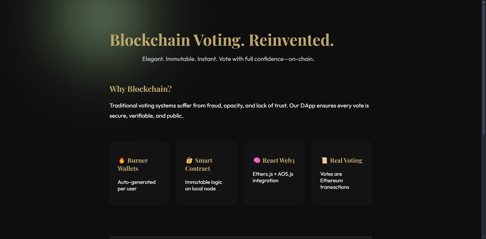

# Blockchain Voting DApp

A secure, transparent, and user-friendly decentralized voting application built with **Solidity**, **React**, and **Ethers.js**.

 <!-- (Optional: Add a screenshot of your app) -->

---

## 🚀 Features

- **On-chain voting:** All votes are recorded on the Ethereum blockchain.
- **Burner wallets:** Each user gets a temporary wallet for privacy and ease of use.
- **Live vote tally:** See real-time results as votes are cast.
- **Exportable logs:** Download all vote events as an Excel file.
- **Confetti animation:** Celebrate your vote with a fun effect!
- **Modern UI:** Built with React and AOS for smooth animations.

---

## 🛠️ Tech Stack

- **Smart Contract:** Solidity, Hardhat
- **Frontend:** React, Ethers.js, AOS, XLSX, FileSaver, Canvas-Confetti
- **Local Blockchain:** Hardhat Network

---

## 📝 How It Works

1. **Start the Hardhat node**  
   Deploy the `Voting` smart contract locally.

2. **Run the React frontend**  
   The app auto-generates a burner wallet, funds it, and connects to the contract.

3. **Vote!**  
   Select a candidate and cast your vote. The transaction is sent on-chain.

4. **See live results**  
   The app fetches and displays the current vote tally.

5. **Export logs**  
   Download all vote events as an Excel file for transparency.

---

## ⚡ Quick Start

### 1. Clone the repo

```sh
git clone https://github.com/protonexe/voting-block.git
cd voting-block
```

### 2. Install dependencies

```sh
# In the root for Hardhat
npm install

# In the frontend folder
cd frontend
npm install
```

### 3. Start Hardhat local node

```sh
npx hardhat node
```

### 4. Deploy the contract

```sh
npx hardhat run scripts/deploy.js --network localhost
```

### 5. Start the React app

```sh
cd frontend
npm start
```

### 6. Open in your browser

Go to [http://localhost:3000](http://localhost:3000)

---

## 🌐 Deploying to Vercel

- Push your frontend code to GitHub.
- Connect your repo to [Vercel](https://vercel.com/).
- Set any required environment variables in the Vercel dashboard.
- Vercel will auto-deploy on every push.

---

## 📄 Contract Overview

```solidity
event VoteCast(address indexed voter, string candidate);

function vote(string memory _candidate) public;
function getCandidates() public view returns (string[] memory);
function getVotes(string memory _candidate) public view returns (uint256);
```

---

## 📦 Project Structure

```
voting-block/
├── contracts/           # Solidity contracts
├── scripts/             # Deployment scripts
├── frontend/            # React app
│   ├── src/
│   ├── public/
│   └── ...
├── hardhat.config.js
└── README.md
```

---

## 🙏 Credits

- [Ethers.js](https://docs.ethers.org/)
- [Hardhat](https://hardhat.org/)
- [React](https://react.dev/)
- [AOS](https://michalsnik.github.io/aos/)
- [Vercel](https://vercel.com/)

---

## 📢 License

MIT

---

*Built with ❤️ by [protonexe](https://github.com/protonexe) and contributors.*
```

